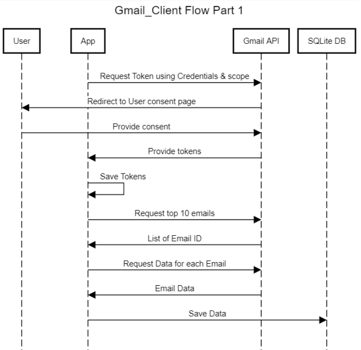
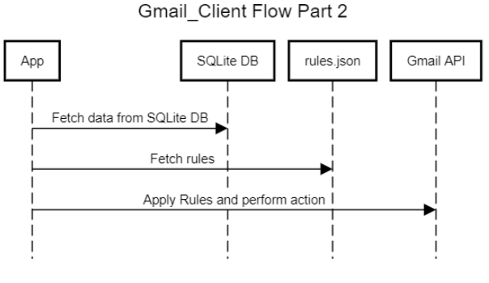

# Gmail Filter App

The Gmail Filter app enables you to manage your emails and apply automatic actions based on your customized filter conditions.
Features currently supported:
- Apply `Equal, Not Equals, Contains, Not Contains` filters based on string fields such as `Subject, from, to, Message etc`
- Apply `Greater than or Less than` date based filter on `Date Received`
- Execute action for `Any match`, `All match` on defined rules
- Possible Actions: `Mark as Read`, `Move to Inbox`

## Getting started

To get started, you need the following setup:
- Logged in Gmail account
- Google Cloud Project
- Enabled the Gmail API Service
- Created Oauth client and have the file 'credentials.json' in the project root

If you are missing anything, follow [Creating the Client ID and Client Secret](https://ei.docs.wso2.com/en/latest/micro-integrator/references/connectors/gmail-connector/configuring-gmail-api/#creating-the-client-id-and-client-secret) 

### Using the Application
> Do not forget to download and place the credentials.json in the project root

1. You can choose to create a [venv](9https://sparkbyexamples.com/python/python-activate-virtual-environment-venv/) or use your default terminal
2. `pip install -r requirements.txt`
3. `python gmail_client.py` To fetch the emails, currently capped at 10 max and store in DB
4. Set the rules in [rules.json](rules.json)
5. `python rule_filter_client.py` To apply the rules and update the mail

### Development and Testing

The application is split up into two halves (according the task description in the document)

  
    

Directory Files:
- [gmail_client](gmail_client.py) and [rule_filter_client](rule_filter_client.py) are the file which execute the above logic in 2 parts.
- [rule_filter_api](rule_filter_api.py) is an extension which uses direct REST API calls instead of using the library, it is not included in test cases.
- [test_gmail_client](test_gmail_client.py) and [test_rule_filter_client](test_rule_filter_client.py) and test files with unit test covering all functionality and scanrios.
- [test_integration](test_integration.py) is an integration test file which has 2 test cases covering both the part 1 and part 2 scenario.
- To run the test cases `pytest`
- To generate the coverage report run `coverage run --omit="rule_filter_api.py,test_*.py" -m pytest` and `coverage report`

Bugs:
- To resolve any token related issues, delete the token.json file and authenticate again.
- For python related issues, make sure you install requirements.txt
- 